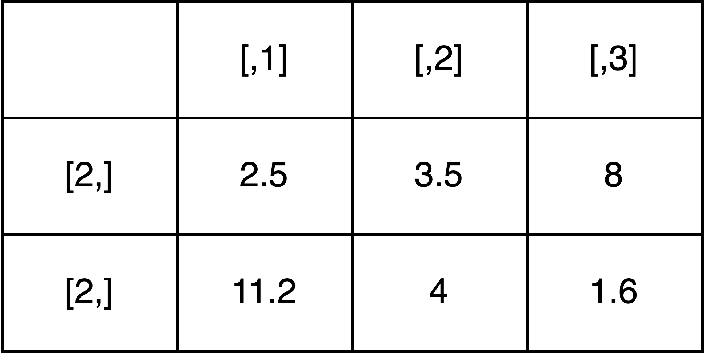
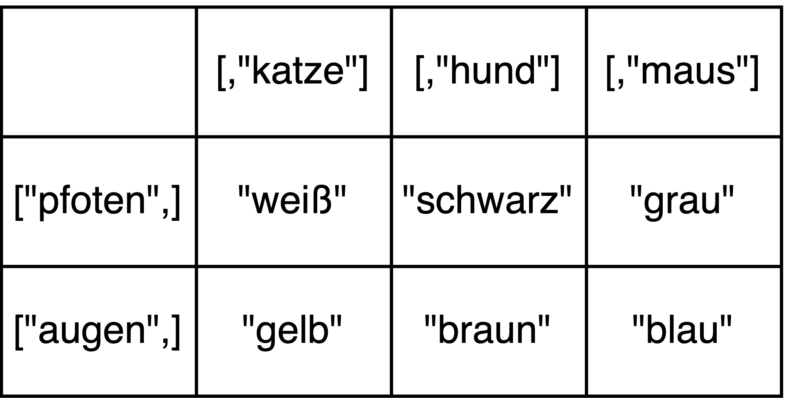
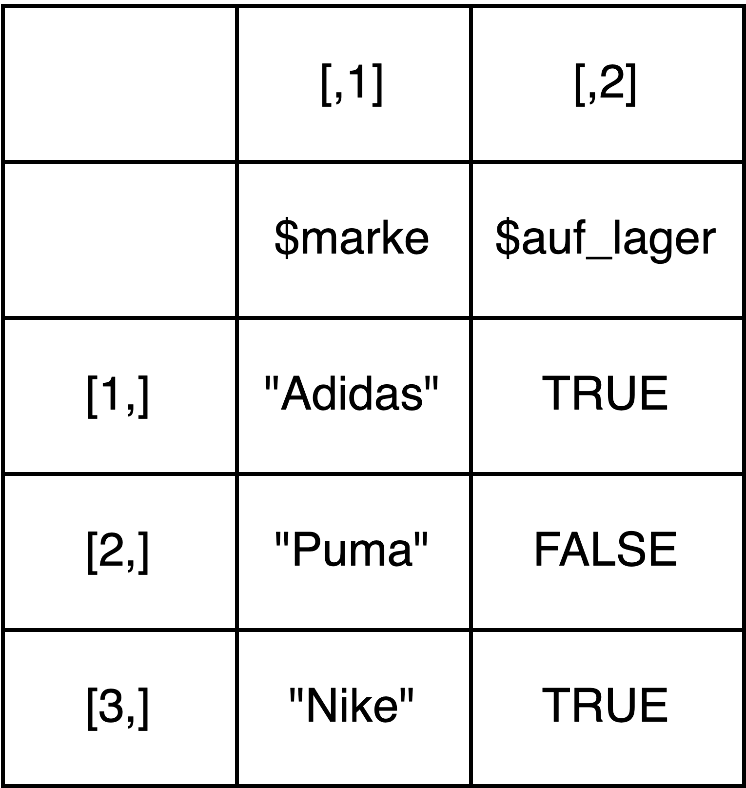

```{r setup, include=FALSE}
library(learnr)
library(tutorial.helpers)
library(learnr.tutorials) # for custom_question_text function

knitr::opts_chunk$set(echo = FALSE, tidy = FALSE)
```


## Aufgabe 1: Wiederholung 

Lest euch nochmal die Inhalte zur Sitzung heute unter dem neuen Kapitel "R Basics III" auf unserer [Kurs-Website](https://lipogg.github.io/textanalyse-mit-r/) durch. Formuliert ein bis drei Fragen zu einem Inhalt, der euch noch nicht ganz klar ist.

```{r manual_frage1}
question_text(
  "Frage 1:",
  answer(".*", correct=TRUE),
  correct = NULL,
  incorrect = NULL,
  placeholder = "z.B. Was ist ein Datentyp?",
  allow_retry = FALSE,
  try_again = FALSE
)
```
```{r manual_frage2}
question_text(
  "Frage 2:",
  answer(".*", correct=TRUE),
  correct = NULL,
  incorrect = NULL,
  placeholder = "z.B. Was ist ein Datentyp?",
  allow_retry = FALSE,
  try_again = FALSE
)
```
```{r manual_frage3}
question_text(
  "Frage 3:",
  answer(".*", correct=TRUE),
  correct = NULL,
  incorrect = NULL,
  placeholder = "z.B. Was ist ein Datentyp?",
  allow_retry = FALSE,
  try_again = FALSE
)
```

## Aufgabe 2: Verständnis

#### 1) Welche Datenstrukturen werden durch die folgenden Bilder repräsentiert?

```{r fig1, echo = FALSE, out.width = "100%"}

```
```{r q2_1_1}
custom_question_text(
  text = " ", 
  variants = c("Matrix", "numeric matrix", "numerische Matrix"),
  incorrect_msg = "Leider nicht richtig. Richtig wäre: Matrix"
  )
```

```{r fig2, echo = FALSE, out.width = "100%"}

```
```{r q2_1_2}
custom_question_text(
  text = " ", 
  variants = c("Matrix", "character matrix", "string matrix"),
  incorrect_msg = "Leider nicht richtig. Richtig wäre: Matrix"
  )
```

```{r fig3, echo = FALSE, out.width = "100%"}

```
```{r q2_1_3}
custom_question_text(
  text = " ", 
  variants = c("Dataframe"), 
  incorrect_msg = "Leider nicht richtig. Richtig wäre: Dataframe"
  )
```

#### 2) Welche Datenstruktur kann am besten zur Abbildung der folgenden Daten verwendet werden?

*Tipp: Wenn ihr nicht darauf kommt, überlegt euch zuerst, welchen Datentyp und ggf. welche Datenstruktur die Elemente der Datenstruktur haben: Sind die Elemente alle vom selben Typ? Sind sie alle gleich groß? Wenn ihr immer noch nicht darauf kommt, könnt ihr euch die Datenstruktur auch auf einem Blatt Papier aufzeichnen und die Daten eintragen. So stellt sich schnell heraus, ob die Datenstruktur geeignet ist.*

*Zur Beantwortung der Frage müsst ihr nur die Datenstruktur nennen, ihr müsst die Beispiele nicht in R implementieren.*

```{r q2_2_1}
custom_question_text(
  text = "Buchtitel auf der Booker Prize Longlist 2023", 
  variants = c("Vektor", "vector"), 
  incorrect_msg = "Nicht ganz richtig. Am besten geeignet wäre ein Vektor."
  )
```


```{r q2_2_2}
custom_question_text(
  text = "Informationen zu allen Kunstwerken, die im Louvre ausgestellt werden: jeweils Titel, Künstler:in, Jahr, und die Information, ob die Kunstwerke gerade verliehen sind oder nicht.", 
  variants = c("Dataframe", "Liste", "list"), 
  incorrect_msg = "Nicht ganz richtig. Am besten geeignet wäre ein Dataframe."
  )
```

```{r q2_2_3}
custom_question_text(
  text = "Informationen zu einem einzigen historischen Ereignis: Startpunkt, Endpunkt, beteiligte historische Personen und URLs zu Online-Publikationen über das Ereignis.", 
  variants = c("Liste", "list"), 
  incorrect_msg = "Nicht ganz richtig. Am besten geeignet wäre eine Liste, denn die Elemente einer Liste können Vektoren unterschiedlicher Länge sein."
  )
```

```{r q2_2_4}
custom_question_text(
  text = "Häufigkeit von Worten in verschiedenen Texten: Wie oft kommt dasselbe Wort in verschiedenen Texten vor?", 
  variants = c("Matrix"), 
  incorrect_msg = "Nicht ganz richtig. Am besten geeignet wäre eine Matrix. Solche Matrizen werden in der Textanalyse mit R häufig verwendet: Die Zeilen sind z.B. nach den Titeln der Texte benannt, und die Spalten nach den Wörtern, die in den Texten vorkommen. In der Matrix stehen Zahlen, die das Vorkommen der Wörter in den Texten repräsentieren."
  )
```

#### 3.) Wenn z.B. in einem Dataframe Daten fehlen, dann kann man dies kenntlich machen, indem man ein spezielles Objekt einsetzt. 


```{r quiz}
quiz(
  caption = "",
  question("Welches Objekt?",
    answer("NULL"),
    answer("NA", correct = TRUE),
    answer("NaN"),
    answer("NICHTS"),
    incorrect = "Leider nicht richtig. Richtig wäre: NA", 
    correct = "Super, das ist richtig!",
    allow_retry = FALSE
  )
)
```

## Aufgabe 3: Praxis

1.) Öffnet RStudio. Erstellt ein neues R Skript und speichert es mit einem geeigneten Dateinamen ab. Verfasst einen Kommentar mit dem Namen der Lehrveranstaltung, der Nummer des Übungsblatts und den Namen aller Bearbeiter:innen. 

2.) Kopiert den folgenden Code in euer R-Skript und führt alle Zeilen aus: 

```{r results = FALSE, echo=TRUE}
df <- data.frame(
  autor_in = c("Oksana Zabuzhko", "Tamta Melashvili", "Aigerim Tazhi", "Marine Petrossian"),
  werk = c("Музей покинутих секретів", "გათვლა", "БОГ-О-СЛОВ", "Բանաստեղծություններ, առաջին գիրք"), 
  jahr = c(2013, 2011, 2004, 1993),
  preis = c("Angelus Award", "Saba Literary Award", "Stupeni Award", NA),
  preisjahr = c(2013, 2011, 2003, NA),
  genre = c("Prosa", "Prosa", "Lyrik", "Lyrik")
)
  
```

3.) Greift auf die Spalte `preis` zu. 

4.) Greift auf das Element in der ersten Spalte und der dritten Zeile zu und lasst es euch auf dem Bildschirm ausgeben. 

5.) Greift auf alle Elemente in der Spalte `werk` zu, für die in der Spalte `jahr` der Wert 2011 eingetragen ist. 

*Hinweis: Wenn ihr euch nicht mehr daran erinnert, wie das geht, ist das gar nicht schlimm. Schaut einfach in Kapitel 2.7.1 auf der Kurswebsite nach.* 

6.) Fügt eine neue Spalte hinzu. Die Spalte soll Wahrheitswerte enthalten: TRUE, wenn ihr das Buch gelesen habt, und FALSE, wenn ihr das Buch nicht gelesen habt. Wenn ihr das Übungsblatt zu zweit bearbeitet, tragt TRUE ein, wenn eine:r von euch das Buch gelesen hat.

7.) Verwendet die Funktion `is.na()` um herauszufinden, ob es in der Spalte `preisjahr` fehlende Werte gibt. 

8.) Ihr sollt jetzt herausfinden, wie viele Werke dem Genre "Prosa" zugehören. Greift dazu erst auf alle Elemente in der Spalte `genre` zu, für die in der Spalte `genre` "Prosa" steht und weist die Elemente einer neuen Variable `prosa` zu. Lasst euch dann mithilfe der Funktion `length()` die Länge des Objekts `prosa` ausgeben: Das ist die Anzahl der Prosawerke! 

9.) Erstellt zuletzt einen neuen Dataframe mit drei Spalten, der eure drei Lieblingsbücher, die Autor_innen und die Publikationsjahre enthält. Weist den Dataframe einer Variable mit einem geeigneten Namen zu. 

*Tipp: Wie ihr am Beispiel oben gesehen habt, können die   Einträge in dem Dataframe auch in nicht-lateinischen Schriften verfasst sein.* 

```{r download-answers, child = system.file("child_documents/download_answers.Rmd", package = "tutorial.helpers")}
```
