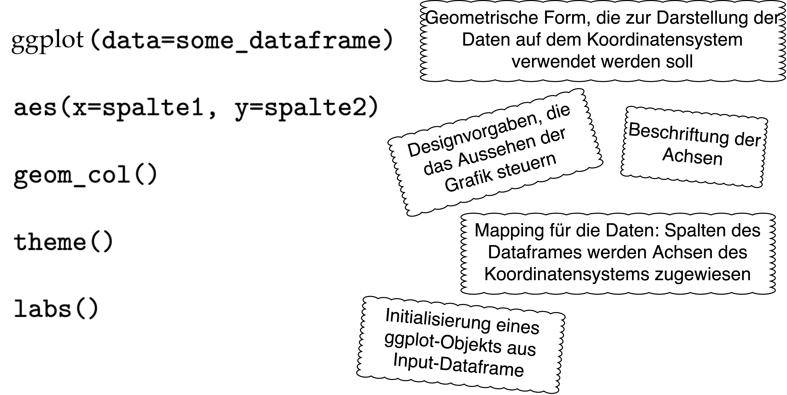

```{r setup, include=FALSE}
library(learnr)
library(tutorial.helpers)
library(learnr.tutorials) # for custom_question_text function
library(sortable) # for drag and drop question
gradethis::gradethis_setup(
  pass = "Super, das ist richtig!",
  fail = "Nicht ganz richtig. Versuch es nochmal."
)

knitr::opts_chunk$set(echo = FALSE, tidy = FALSE)
```

## Aufgabe 1: Wiederholung

Lest euch nochmal die Inhalte zur Sitzung heute unter dem neuen Kapitel "Textanalyse III" auf unserer [Kurs-Website](https://lipogg.github.io/textanalyse-mit-r/) durch. Formuliert ein bis drei Fragen zu einem Inhalt, der euch noch nicht ganz klar ist.

```{r manual_frage1}
question_text(
  "Frage 1:",
  answer(".*", correct=TRUE),
  correct = NULL,
  incorrect = NULL,
  placeholder = "z.B. Was ist ein Datentyp?",
  allow_retry = FALSE,
  try_again = FALSE
)
```
```{r manual_frage2}
question_text(
  "Frage 2:",
  answer(".*", correct=TRUE),
  correct = NULL,
  incorrect = NULL,
  placeholder = "z.B. Was ist ein Datentyp?",
  allow_retry = FALSE,
  try_again = FALSE
)
```
```{r manual_frage3}
question_text(
  "Frage 3:",
  answer(".*", correct=TRUE),
  correct = NULL,
  incorrect = NULL,
  placeholder = "z.B. Was ist ein Datentyp?",
  allow_retry = FALSE,
  try_again = FALSE
)
```

## Aufgabe 2: Verständnis

#### 1.) Beantwortet die folgenden Fragen in einem Satz in euren eigenen Worten. 


```{r q2_1_1}
question_text(
  "Was besagt das Zipf'sche Gesetz und welche Rolle spielt es beim Preprocessing?",
  answer(".*", correct=TRUE),
  correct = NULL,
  incorrect = NULL,
  placeholder = "Antwort eingeben...",
  allow_retry = FALSE,
  try_again = FALSE,
  message = "Das Zipf'sche Gesetz besagt, dass in einem Korpus von natürlichsprachlichen Äußerungen die Häufigkeit irgendeines Wortes umgekehrt proportional zu seinem Rang in der Häufigkeitstabelle ist: das zweithäufigste Wort kommt halb so oft vor wie das häufigste, das dritthäufigste ein Drittel so oft wie das zweithäufigste, usw."
)
```

```{r q2_1_2}
question_text(
  "Welchen Einfluss hat die Lemmatisierung auf die Worthäufigkeiten?",
  answer(".*", correct=TRUE),
  correct = NULL,
  incorrect = NULL,
  placeholder = "Antwort eingeben...",
  allow_retry = FALSE,
  try_again = FALSE,
  message = "Durch die Lemmatisierung steigen die absoluten Häufigkeiten für Wörter, die vor der Lemmatisierung in verschiedenen Flexionsformen vorkommen (z.B. gehen, gehe, ging, gegangen, ...)."
)
```

```{r q2_1_3}
question_text(
  "Was ist der Unterschied zwischen absoluten Häufigkeiten, relativen Häufigkeiten und TF-IDF?",
  answer(".*", correct=TRUE),
  correct = NULL,
  incorrect = NULL,
  placeholder = "Antwort eingeben...",
  allow_retry = FALSE,
  try_again = FALSE,
  message = "Absolute Häufigkeiten beschreiben in unserem Kontext, wie oft ein bestimmtes Wort in einem Korpus vorkommt. Relative Häufigkeiten beschreiben, wie oft ein Wort relativ zur Gesamtanzahl aller Wörter im Korpus vorkommt. TF-IDF beschreibt, wie oft ein Wort in einem Text im Vergleich zu den anderen Texten im Korpus vorkommt."
)
```

#### 2.) Ordnet die folgenden Bestandteile einer ggplot2-Grafik ihrer jeweiligen Bedeutung zu, indem ihr die Definitionen auf der rechten Seite in der Reihenfolge der Codezeilen anordnet. 

```{r fig1, echo = FALSE, out.width = "100%"}

```


```{r drag_and_drop_code}
# Antwortoptionen
definitionen <- c(
    "Geometrische Form, die zur Darstellung der Daten auf dem Koordinatensystem verwendet werden soll.",
    "Designvorgaben, die das Aussehen der Grafik steuern",
    "Beschriftung der Achsen",
    "Mapping für die Daten: Spalten des Dataframes werden Achsen des Koordinatensystems zugewiesen",
    "Initialisierung eines ggplot-Objekts aus Input-Dataframe"
  )

definitionen_korrekt <- c(
    "Initialisierung eines ggplot-Objekts aus Input-Dataframe",
    "Mapping für die Daten: Spalten des Dataframes werden Achsen des Koordinatensystems zugewiesen",
    "Geometrische Form, die zur Darstellung der Daten auf dem Koordinatensystem verwendet werden soll.",
    "Designvorgaben, die das Aussehen der Grafik steuern",
    "Beschriftung der Achsen"
  )

# Frage
question_rank(
  "",
  answer(definitionen, correct = FALSE),
  answer(definitionen_korrekt, correct = TRUE),
  allow_retry = TRUE,
  correct = "Super, das ist richtig!",
  incorrect = "Leider nicht richtig. Versuch es nochmal.",
  submit_button = "Antwort einreichen",
  try_again_button = "Nochmal versuchen"
)

```


#### 3.) (fakulativ) Lest den folgenden Text zur Distributional Hypothesis und fasst in zwei Sätzen zusammen, was die Distributional Hypothesis besagt. Erinnert euch an den Beitrag von Evelyn Gius und Janina Jacke aus der ersten Woche. Inwieweit lässt sich die Kritik von Gius und Jacke auf die in dem Kapitel von Lenci und Sahlgren vorgestellten theoretischen Annahmen anwenden? Was denkt ihr: entsprechen die Annahmen der Distributional Hypothesis eurer Vorstellung von Sprache und Bedeutung?  

* Alessandro Lenci und Magnus Sahlgren (2023). *Distributional Semantics, Ch. 1: From Usage to Meaning. The Foundations of Distributional Semantics*, pp. 3-25, https://doi.org/10.1017/9780511783692.002.

```{r q2_3}
question_text(
  "",
  answer(".*", correct=TRUE),
  correct = NULL,
  incorrect = NULL,
  placeholder = "Antwort eingeben...",
  allow_retry = FALSE,
  try_again = FALSE
)
```

##### 4.) (fakultativ) Lest den optionalen Abschnitt zum mathematischen Hintergrund von TF-IDF. Berechnet danach händisch (also ohne die Hilfe der Funktion `dfm_tfidf()`) wie im Beispiel auf der Kurswebsite den TF-IDF Wert für ein Token, das insgesamt 50 mal vorkommt. Das Token kommt dabei in 35 verschiedenen Texten vor und das Korpus hat 200 Texte. 

```{r tfidf, exercise=TRUE}

tf <- ____ 
idf <- ____
tfidf <- ____
tfidf

```

```{r tfidf-solution}
tf <- 50
idf <- log10(200/35)
tfidf <- tf * idf
tfidf

```

```{r tfidf-check} 

grade_this_code()

```


## Aufgabe 3: Praxis

*Zur Bearbeitung dieser Aufgaben benötigt ihr die RDS-Datei, die ihr bei der Bearbeitung von Übungsblatt 8 erstellt habt.* 

1.) Öffnet RStudio. Erstellt ein neues R Skript und speichert es mit einem geeigneten Dateinamen ab. Verfasst einen Kommentar mit dem Namen der Lehrveranstaltung, der Nr. des Übungsblatts und euren Namen.

2.) Setzt euer Arbeitsverzeichnis auf den Ordner, in dem sich die RDS-Datei, die ihr bei der Bearbeitung von Übungsblatt 8 erstellt habt, befindet. Die Datei sollte den UDPipe-Dataframe enthalten. 

3.) Lest die RDS-Datei ein. 

*Hinweis: Den Code zum Einlesen von RDS-Dateien findet ihr auf der Kurswebsite im [Abschnitt 5.10](https://lipogg.github.io/textanalyse-mit-r/textanalyse-i-korpus-tokens-daten-und-dateien.html#daten-schreiben).*

4.) Entfernt alle Zeilen mit NA-Werten aus dem Dataframe. Falls es in dem Dataframe Tokens gibt, für die verschiedene Lemmata angegeben sind, entscheidet euch für eine Variante und löscht die anderen Varianten. 

*Hinweis: Den Code dazu findet ihr im [Abschnitt 7.7.2](https://lipogg.github.io/textanalyse-mit-r/textanalyse-ii-preprocessing.html#methode-2-lemmatisierung-mit-udpipe).*
 
5.) Erstellt aus den Spalten lemma und doc_id ein Quanteda-Tokens-Objekt. 

*Hinweis: Den Code dazu findet ihr im [Abschnitt 7.7.2](https://lipogg.github.io/textanalyse-mit-r/textanalyse-ii-preprocessing.html#methode-2-lemmatisierung-mit-udpipe).*

6.) Führt weitere Preprocessing-Schritte aus: Entfernt die Stoppwörter und wandelt alle Buchstaben in Kleinbuchstaben um. 

*Hinweis: Den Code dazu findet ihr im [Kapitel 7](https://lipogg.github.io/textanalyse-mit-r/textanalyse-ii-preprocessing.html).* 

7.) Erstellt eine Wortwolke. 

*Hinweis: Dazu muss erst aus dem Tokens-Objekt ein DFM-Objekt erstellt werden sowie das Paket quanteda.textplots installiert und geladen werden. Den Code dazu findet ihr im [Abschnitt 8.3.1](https://lipogg.github.io/textanalyse-mit-r/textanalyse-iii-wortfrequenzanalysen.html#absolute-h%C3%A4ufigkeiten-und-das-zipfsche-gesetz).*

8.) Verwendet die Funktion `textstat_frequency()`, um euch die 20 häufigsten Tokens etwas genauer anzusehen. Dabei interessiert euch die Häufigkeit der Tokens über alle Texte hinweg. Welches Token kommt insgesamt am häufigsten vor? Welches Token kommt in den meisten Texten vor?

*Hinweis: Den Code dazu findet ihr im [Kapitel 8](https://lipogg.github.io/textanalyse-mit-r/textanalyse-iii-wortfrequenzanalysen.html). Beachtet, dass wir die Funktion `textstat_frequency()` einmal mit dem zusätzlichen Argument groups=Titel aufgerufen haben. Braucht ihr dieses Argument, um die Häufigkeit über alle Texte hinweg zu bekommen? Entscheidet selbst.*

9.) Speichert zuletzt das Tokens-Objekt mithilfe der Funktion saveRDS() in einer RDS-Datei.

10.) (fakultativ) Die Funktion `textstat_frequency()` erzeugt einen Dataframe mit den Spalten feature, frequency, rank, docfreq und group. Erstellt mithilfe der ggplot2-Funktion `ggplot()` ein Säulendiagramm. Auf der x-Achse sollen die 20 häufigsten Tokens abgebildet werden (Spalte feature). Auf der y-Achse soll die Anzahl der Texte, in denen das Token vorkommt, abgebildet werden (Spalte docfreq). 

*Hinweis: Den Code dazu findet ihr nicht auf der Kurswebsite, aber ihr könnt die ggplot-Dokumentationsseiten zu Rate ziehen, um die richtige Funktion zum Erzeugen der geom-Ebene auszuwählen. Falls ihr nicht darauf kommt: [hier](https://ggplot2.tidyverse.org/reference/geom_bar.html) findet ihr die richtige Funktion. Aber Achtung: Säule heißt auf Englisch column.*

11.) (fakultativ) Berechnet für zwei Texte aus dem Korpus TF-IDF Werte. Reproduziert dazu den Code im [Abschnitt 8.3.3 auf der Kurswebsite](https://lipogg.github.io/textanalyse-mit-r/textanalyse-iii-wortfrequenzanalysen.html#relative-h%C3%A4ufigkeiten-und-tf-idf). 


```{r download-answers, child = system.file("child_documents/download_answers.Rmd", package = "tutorial.helpers")}
```
