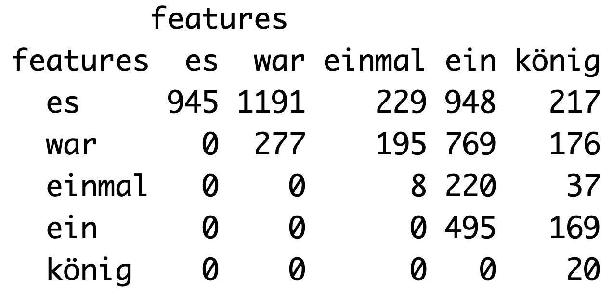
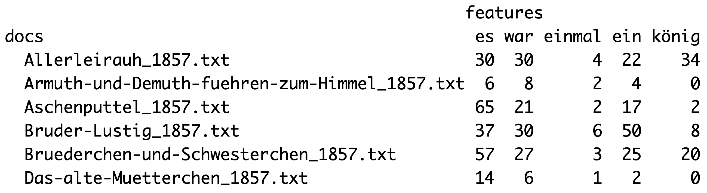

```{r setup, include=FALSE}
library(learnr)
library(tutorial.helpers)
library(learnr.tutorials) # for custom_question_text function

knitr::opts_chunk$set(echo = FALSE)
```

## Aufgabe 1: Wiederholung

Lest euch nochmal die Inhalte zur Sitzung heute unter dem neuen Kapitel "Textanalyse III" auf unserer [Kurs-Website](https://lipogg.github.io/textanalyse-mit-r/) durch. Lest dabei auch den neuen Abschnitt "8.4.4 Was bedeutet das gemeinsame Vorkommen zweier Wörter?". Formuliert ein bis drei Fragen zu einem Inhalt, der euch noch nicht ganz klar ist.

```{r manual_frage1}
question_text(
  "Frage 1:",
  answer(".*", correct=TRUE),
  correct = NULL,
  incorrect = NULL,
  placeholder = "z.B. Was ist ein Datentyp?",
  allow_retry = FALSE,
  try_again = FALSE
)
```
```{r manual_frage2}
question_text(
  "Frage 2:",
  answer(".*", correct=TRUE),
  correct = NULL,
  incorrect = NULL,
  placeholder = "z.B. Was ist ein Datentyp?",
  allow_retry = FALSE,
  try_again = FALSE
)
```
```{r manual_frage3}
question_text(
  "Frage 3:",
  answer(".*", correct=TRUE),
  correct = NULL,
  incorrect = NULL,
  placeholder = "z.B. Was ist ein Datentyp?",
  allow_retry = FALSE,
  try_again = FALSE
)
```

## Aufgabe 2: Verständnis

#### 1.) Wie viele N-Gramme und Kookkurrenzen von "Guten" mit dem Wort "Tag" gibt es jeweils im Beispieltext *"Guten Tag, Max Mustermann. Guten Morgen wünsche ich Ihnen an diesem Tag. Guten Tag!"*?

```{r q2_1a}
question_text(
  "N-Gramme",
  answer("2", correct=TRUE),
  correct = "Super, das ist richtig!",
  incorrect = 'Leider nicht richtig. Richtig wäre: 2.',
  placeholder = "Antwort eingeben...",
  allow_retry = FALSE,
  try_again = FALSE
)
```
```{r q2_1b}
question_text(
  "Kookkurrenzen",
  answer("3", correct=TRUE),
  answer("9", correct=TRUE),
  correct = "Super, das ist richtig!",
  incorrect = 'Leider nicht richtig. Richtig wäre: 3 (wenn der Kontext ein Satz ist) oder 9 (wenn der Kontext der gesamte Text ist).',
  placeholder = "Antwort eingeben...",
  allow_retry = FALSE,
  try_again = FALSE
)
```

2.) Für welche der folgenden Analysemethoden bzw. Visualisierungen sollten Stoppwörter während des Preprocessing entfernt werden? 

```{r quiz2_2}
quiz(
  caption = "",
  question_checkbox("",
    answer("Keywords in Context (KWIC)"),
    answer("Wortwolke", correct = TRUE),
    answer("Bestimmung von N-Grammen", correct = TRUE),
    answer("Bestimmung von Kookkurrenzen", correct = TRUE),
    answer("Bestimmung von Kollokationen", correct = TRUE),
    incorrect = "Nicht ganz richtig. Richtig wären: Wortwolke,  ", 
    correct = "Super, das ist richtig!",
    message = "Die Antwort ist nicht ganz eindeutig; wann Stoppwörter entfernt werden sollten, ist immer auch abhängig von der konkreten Forschungsfrage. Niemals sollten aber Stoppwörter (oder auch Satzzeichen) entfernt werden, wenn Schlüsselwörter in ihrem Kontext betrachtet werden (KWIC).",
    allow_retry = FALSE
  )
)

```


3.) Wie heißen die beiden Matrizen in Quanteda? Erläutert außerdem in einem Satz, was jede Matrix darstellt. 

```{r fig1, echo = FALSE, out.width = "100%"}

```

```{r matrix_1}
custom_question_text(
  text = "", 
  variants = c("Feature Cooccurrence Matrix", "Feature Co-occurrence Matrix", "FCM"), 
  incorrect_msg = "Leider nicht richtig. Richtig wäre: Feature co-occurrence matrix (FCM)"
  )
```

```{r fig2, echo = FALSE, out.width = "100%"}

```

```{r matrix_2}
custom_question_text(
  text = "", 
  variants = c("Document Feature Matrix", "Document-Feature Matrix", "DFM"), 
  incorrect_msg = "Leider nicht richtig. Richtig wäre: Document-feature matrix (DFM)"
  )
```

## Aufgabe 3: Praxis 

**Achtung: Vor der Bearbeitung dieser Aufgaben müsst ihr den Zip-Ordner `maerchen_uebung.zip` (s. Blackboard) abspeichern und entpacken. Zur Bearbeitung der Teilaufgaben müsst ihr nur den entsprechenden Code aus dem Kapitel 8 anpassen. Die Aufgaben sollen deswegen auch dabei helfen, den Code, den wir in den letzten Stunden besprochen haben, besser zu verstehen.** 

1.) Öffnet RStudio. Erstellt ein neues R Skript und speichert es mit einem geeigneten Dateinamen ab. Verfasst einen Kommentar mit dem Namen der Lehrveranstaltung, der Nr. des Übungsblatts und euren Namen.

2.) Setzt euer Arbeitsverzeichnis auf den Ordner, in dem sich der Ordner mit dem Namen "maerchen_alle" befindet. 

*Zur Erinnerung: Wie das geht könnt ihr im Abschnitt [Abschnitt 5.4](https://lipogg.github.io/einfuehrung-in-r/textanalyse-i-korpus-tokens-daten-und-dateien.html#textdateien-einlesen) auf der Kurswebsite nachlesen. Im Kapitel ["Orientierung im RStudio"](https://lipogg.github.io/einfuehrung-in-r/orientierung-im-rstudio.html) findet ihr außerdem einen Screenshot, der erläutert, wie ihr das Arbeitsverzeichnis über die RStudio-Nutzeroberfläche setzen könnt.*

3.) Ladet die Pakete readtext, quanteda, quanteda.textstats, ggplot2 und plotly. Falls ihr noch nicht alle Pakete installiert habt, müsst ihr die Pakete erst installieren. 

4.) Lest jetzt alle Texte aus dem Ordner mit dem Namen "maerchen_alle" ein. Extrahiert dabei den Titel der Märchen und das Publikationsjahr aus den Dateinamen.  

*Hinweis: Ihr könnt dazu einfach den Code vom Übungsblatt 9 übernehmen oder den Code vom Übungsblatt 8 oder aus dem [Abschnitt 5.4](https://lipogg.github.io/einfuehrung-in-r/textanalyse-i-korpus-tokens-daten-und-dateien.html#textdateien-einlesen) auf der Kurswebsite anpassen. Ihr müsst nur die Argumente "korpus/\*.txt" und `docvarnames` anpassen. Nennt das Objekt maerchen_texte statt ger_texte.*

5.) Erstellt ein Quanteda corpus-Objekt. 

6.) Erstellt ein Teilkorpus nur mit Märchen aus dem Jahr 1857.

*Hinweis: Den Code dazu findet ihr im [Abschnitt 8.2](https://lipogg.github.io/einfuehrung-in-r/textanalyse-iii-wortfrequenzanalysen.html#corpus-objekt-erstellen-und-preprocessing) auf der Kurswebsite.*

7.) Erstellt ein tokens-Objekt. Nutzt dazu das corpus-Objekt mit dem Teilkorpus aus Teilaufgabe 6.

8.) Lasst euch das Schlüsselwort "sohn" mithilfe der Quanteda-Funktion `kwic()` im Kontext ausgeben. Nutzt dabei die unscharfe Suche mit `*` und das Argument `case_insensitive = TRUE`.

*Hinweis: Den Code dazu findet ihr im [Abschnitt 8.4](https://lipogg.github.io/einfuehrung-in-r/textanalyse-iii-wortfrequenzanalysen.html#keywords-in-context-kwic) auf der Kurswebsite.* 

Bei der Durchsicht der Textstellen in Teilaufgabe 8 fallen anders als bei den Tochter-Tokens diesmal keine  Wortkombinationen auf, die interessant erscheinen. Ihr wollt euch deswegen alle Bigramme mit Tokens, die  "sohn" enthalten, ansehen.  

*Hinweis: Den Code zu den Teilaufgaben 9-12 findet ihr in [Abschnitt 8.5](https://lipogg.github.io/einfuehrung-in-r/textanalyse-iii-wortfrequenzanalysen.html#n-gramme) auf der Kurswebsite.*

9.) Um sicherzugehen, dass die Bigramme keine Satzgrenzen überschreiten, muss zunächst das corpus-Objekt so umstrukturiert werden, dass die Dokumente nicht die einzelnen Märchen repräsentieren, sondern einzelne Sätze in den Märchen. Verwendet die Quanteda-Funktion `corpus_reshape()` um das Korpus in die gewünschte Struktur zu bringen. 

10.) Tokenisiert anschließend das neue corpus-Objekt. Entfernt dabei alle Satzzeichen und wandelt anschließend alle Tokens in Kleinbuchstaben um. 

11.) Extrahiert alle Bigramme, die ein Token mit der Zeichenkette "sohn" enthalten. Passt dazu den folgenden Code von der Kurswebsite an: 

```{r eval=FALSE, echo=TRUE}
toks_bigram_tochter <- maerchen_sentences_toks %>%
  tokens_compound(pattern = phrase("* *tochter*")) %>%
  tokens_select(pattern = phrase("*_*tochter*"))
```

12.) Erstellt anschließend eine DFM und erstellt mithilfe der Funktion `textstat_frequency()` einen Dataframe mit Statistiken zu den Features der DFM. Nennt den Dataframe `bigram_freq`.

*Hinweis: Das zusätzliche Argument groups=Titel wird in diesem Fall nicht benötigt.*

13.) Die Funktion `textstat_frequency()` erzeugt einen Dataframe mit den Spalten feature, frequency, rank, docfreq und group. Erstellt mithilfe der ggplot2-Funktion `ggplot()` ein Säulendiagramm für das Objekt `bigram_freq`. Auf der x-Achse sollen die 20 häufigsten Bigramme abgebildet werden (Spalte feature). Auf der y-Achse soll die Anzahl der Texte, in denen das Token vorkommt, abgebildet werden (Spalte docfreq).

*Hinweis: Den Code dazu findet ihr nicht auf der Kurswebsite, aber ihr könnt die ggplot-Dokumentationsseiten zu Rate ziehen, um die richtige Funktion zum Erzeugen der geom-Ebene auszuwählen. Falls ihr nicht darauf kommt: [hier](https://ggplot2.tidyverse.org/reference/geom_bar.html) findet ihr die richtige Funktion. Aber Achtung: Säule heißt auf Englisch column.*

14.) Wandelt zuletzt das ggplot-Objekt aus Teilaufgabe 13 in ein plotly-Objekt um.

*Hinweis: Dazu könnt ihr die Funktion ggplotly() verwenden.*

Dem Säulendiagramm könnt ihr entnehmen, dass es nur zwei Bigramme mit "schön" und "sohn" gibt, aber einige Bigramme mit "lieb" und "sohn", und einige Bigramme mit "jung" und "alt". 

15.) Um die Sohn-Tokens mit den Tochter-Tokens zu vergleichen, wollt ihr zuletzt eine Heat Map mit den Kookkurrenzen aller Tokens mit "schön" und "sohn" erstellen. Reproduziert den Code unter [Abschnitt 8.4.3 "Kookkurrenzen"](https://lipogg.github.io/textanalyse-mit-r/textanalyse-iii-wortfrequenzanalysen.html#kookkurrenzen) auf der Kurswebsite für die Sohn-Tokens. 

*Hinweis: Dabei könnt ihr genauso vorgehen wie bei der Erstellung der Heat Map für die Tochter-Tokens. Ihr könnt also einfach den Code aus dem Abschnitt übernehmen. Ihr müsst nur den regulären Ausdruck "tochter" in der grepl-Funktion anpassen und die Variablen umbenennen. Verwendet zur Erstellung der FCM das corpus-Objekt aus Teilaufgabe 6.*

## Freiwillige Zusatzaufgabe: Kollokationen

#### 1.) Berechnet manuell (das heißt mit Taschenrechner, aber ohne R) die Werte für Lambda ($\lambda$) und $z$ nach den Formeln aus der [Dokumentationsseite zur Funktion `textstat_collocations()`](https://quanteda.io/reference/textstat_collocations.html) für das folgende Beispiel: 

- Beispielsatz (unser Korpus): "Guten Tag Max Mustermann wie geht es Ihnen Guten Tag"
- $K$-word target expression $x$ = "Guten Tag"
- $K$ = 2 (weil "Guten Tag" aus zwei Wörtern besteht)
- $z_r$ = "Guten Tag", "Tag Max", "Max Mustermann", "Mustermann wie", "wie geht", "geht es", "es Ihnen", "Ihnen Guten", "Guten Tag" 

$\log(n_i)$ bedeutet hier Logarithmus zur Basis $e$, also $\log_e(n_i)$.

Hinweise:

Wir müssen zunächst klären, was $M$, $n_i$ und $b_i$ sind. 

$M$ = $2^K$, also 4. Das sind die möglichen Permutationen ("possible values") für $c_i$. 

$c_i$ sind die möglichen Fälle, die beim Vergleich der Wortkombination "Guten Tag" mit allen Wortkombinationen $z_r$ auftreten können: 
 
- $c_1$ = (0,0) (sowohl das erste als auch das zweite Wort in x ist ungleich dem ersten und zweiten Wort in z: Beispiel "Max Mustermann")
- $c_2$ = (1,0) (das erste Wort in $x$ ist gleich dem ersten Wort in $z$, aber das zweite Wort ist nicht gleich dem zweiten Wort: Beispiel "\underline{Guten} Abend")
- $c_3$ = (0,1) (das zweite Wort in $x$ ist gleich dem zweiten Wort in z, aber das erste Wort ist nicht gleich dem ersten Wort: Beispiel "schönen \underline{Tag}") 
- $c_4$ = (1,1) (beide Wörter in $x$ und $z$ sind gleich: In unserem Fall "\underline{Guten} \underline{Tag}") 

$b_i$ sind die Anzahl an Einsen in den verschiedenen Fällen $c_i$. In unserem Beispiel: 

- $b_1$ = 0 (weil $c_1$ keine 1 enthält) 
- $b_2$ = 1 (weil $c_2$ eine 1 enthält) 
- $b_3$ = 1 (weil $c_3$ eine 1 enthält) 
- $b_4$ = 2 (weil $c_4$ zweimal 1 enthält)

$n_i$ sind die Anzahl der Wortkombinationen aus $z_r$, für die der jeweilige Fall $c_i$ zutrifft, also: 
 
- $n_1$ = 7 (es gibt 7 Wortkombinationen, die weder "Guten" noch "Tag" an der richtigen Stelle enthalten, z.B. "Tag Max", "Max Mustermann", "Mustermann wie", .....) 
- $n_2$ = 0 (es gibt keine Wortkombination mit "Guten" an der ersten Stelle) 
- $n_3$ = 0 (es gibt keine Wortkombination mit "Tag" an der zweiten Stelle) 
- $n_4$ = 2 ("Guten Tag" kommt zweimal vor)

Jedes $n_i$ wird noch mit dem "smoothing parameter" addiert (dieser soll verhindern, dass Operationen der Art $\log_e(0)$ oder $0^{-1}$ notwendig werden). Der smoothing Parameter ist per Default 0.5.
Daraus ergibt sich: $n_1$ = 7.5, $n_2$ = 0.5, $n_3$ = 0.5, $n_4$ = 2.5 

Wenn wir diese Werte in die Formel einsetzen, erhalten wir: 

$\lambda = ((-1)^2*\log_e(7.5)) + ((-1)^1*\log_e(0.5)) + ((-1)^1*\log_e(0.5)) + ((-1)^0*\log_e(2.5))$

Und entsprechend für $z$: 

$z = \frac{\lambda}{(n_1^{-1} + n_2^{-1} + n_3^){-1} + n_4^{-1})^{(\frac{1}{2})}}
= \frac{\lambda}{(7.5^{-1} + 0.5^{-1} + 0.5^{-1} + 2.5^{-1})^{(\frac{1}{2})}}$


#### 2.) Vergleicht die berechneten Werte mit den Werten, welche die Quanteda `textstat_collocations()`-Funktion berechnet, indem ihr den folgenden Code ausführt. Stimmen die Werte überein? 

```{r eval=FALSE, echo=TRUE}
library(quanteda)
library(quanteda.textstats)
test <- "Guten Tag Max Mustermann wie geht es Ihnen Guten Tag"
test_cor <- corpus(test)
test_toks <- tokens(test)
textstat_collocations(test_toks, min_count=1)
```

#### 3.) Wir haben in der Stunde bereits beobachtet, dass die Gesamthäufigkeit der Tokens in einer Wortkombination die $\lambda$- und $z$-Werte beeinträchtigt. Das können wir anhand der beiden Formeln etwas genauer untersuchen. Wir nehmen an, eine Wortkombination $x$ kommt nur einmal vor ($n_4$ = 1.5) und es kommen sonst 10 Wortkombinationen vor ohne irgendeines der beiden Wörter aus $x$ ($n_1$ = 10.5). Wenn eines der beiden Wörter aus der Wortkombination $x$ im Gesamtkorpus häufig vorkommt, dann wird es höhere Werte für $n_2$ oder $n_3$ geben, weil dieses Wort dann mit anderen Wörtern zusammen auftritt. 

- Wie groß ist $\lambda$ für $n_2$ = 8.5 und $n_3$ = 0.5?
- Wie groß ist $\lambda$ für $n_2$ = 0.5 und $n_3$ = 0.5? 

Zuletzt können wir auch die Formel für die z-Statistik untersuchen. Wie wir gesehen haben, werden die $z$-Werte als Bruch mit $\lambda$ im Zähler definiert. 

- Wie wirkt sich ein hohes $\lambda$ im Zähler auf den $z$-Wert aus? 
- Wie wirkt sich ein niedriger Wert für $\lambda$ auf den $z$-Wert aus? 
- Wie beeinflussen die Werte im Nenner das Ergebnis? 

Ohne tief in die Statistik einzusteigen, können wir also schon durch einfaches Nachrechnen nachvollziehen, warum die Gesamthäufigkeit der Tokens in einer Wortkombination einen Einfluss auf die $\lambda$- und $z$-Werte haben muss. 


```{r download-answers, child = system.file("child_documents/download_answers.Rmd", package = "tutorial.helpers")}
```
