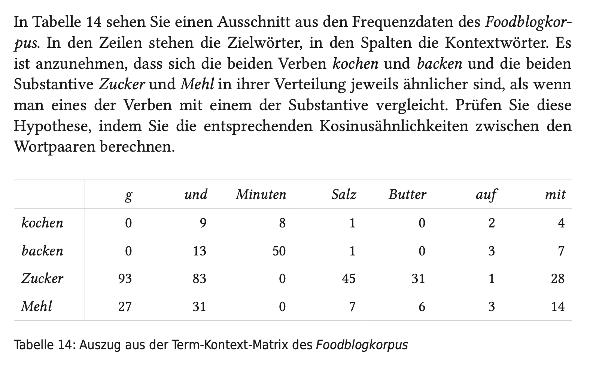

```{r setup, include=FALSE}
library(learnr)
library(tutorial.helpers)
library(learnr.tutorials) # for custom_question_text function
library(gradethis)
gradethis::gradethis_setup(
  pass = "Super, das ist richtig!",
  fail = "Nicht ganz richtig. Versuch es nochmal."
)
knitr::opts_chunk$set(echo = FALSE, tidy = FALSE)
```


## Aufgabe 1: Wiederholung

Lest euch nochmal die Inhalte zur Sitzung heute unter dem neuen Kapitel "Word Embeddings und NER" auf unserer [Kurs-Website](https://lipogg.github.io/textanalyse-mit-r/) durch. Formuliert ein bis drei Fragen zu einem Inhalt, der euch noch nicht ganz klar ist.

```{r manual_frage1}
question_text(
  "Frage 1:",
  answer(".*", correct=TRUE),
  correct = NULL,
  incorrect = NULL,
  placeholder = "z.B. Was ist ein Datentyp?",
  allow_retry = FALSE,
  try_again = FALSE
)
```
```{r manual_frage2}
question_text(
  "Frage 2:",
  answer(".*", correct=TRUE),
  correct = NULL,
  incorrect = NULL,
  placeholder = "z.B. Was ist ein Datentyp?",
  allow_retry = FALSE,
  try_again = FALSE
)
```
```{r manual_frage3}
question_text(
  "Frage 3:",
  answer(".*", correct=TRUE),
  correct = NULL,
  incorrect = NULL,
  placeholder = "z.B. Was ist ein Datentyp?",
  allow_retry = FALSE,
  try_again = FALSE
)
```

## Aufgabe 2: Verständnis NER und Word Embeddings

#### Beantwortet kurz (in einem Satz) die folgenden Fragen: 

```{r q2_fcm}
question_text(
  'Warum werden die Vektoren in einer Feature Co-Occurrence-Matrix auch "lang und spärlich" genannt?',
  answer(".*", correct=TRUE),
  correct = NULL,
  incorrect = NULL,
  placeholder = "Antwort eingeben...",
  allow_retry = FALSE,
  try_again = FALSE, 
  message = ""
)
```
```{r q2_word_embeddings}
question_text(
  "Was ist der Unterschied zwischen statischen und kontextualisierten Word Embeddings?",
  answer(".*", correct=TRUE),
  correct = NULL,
  incorrect = NULL,
  placeholder = "Antwort eingeben...",
  allow_retry = FALSE,
  try_again = FALSE,
  message = ""
)
```
```{r q2_ner}
question_text(
  "Was ist das Ziel der Named Entity Recognition?",
  answer(".*", correct=TRUE),
  correct = NULL,
  incorrect = NULL,
  placeholder = "Antwort eingeben...",
  allow_retry = FALSE,
  try_again = FALSE, 
  message = ""
)
```

## Hinweis zu Aufgabe 3

#### Von den folgenden drei Aufgaben dürft ihr euch je nach Interesse eine (oder auch mehr) zur Bearbeitung auswählen. Aufgabe 3a ist eine reine Verständnisaufgabe, Aufgabe 3b ist eine reine Praxisaufgabe, und Aufgabe 3c ist eine Kombination aus Verständnis- und Praxisaufgabe.


## Aufgabe 3a: Verständnis NER 

Schaut einen Ausschnitt aus dem folgenden Vortrag von Alan Akbik, einem der Entwickler:innen des Flair-Systems, das wir im Rahmen der Named Entity Recognition kennen gelernt haben.

* Alan Akbik, Das FLAIR Framework zur automatischen Analyse von Texten, https://www.youtube.com/live/LqElF1eZ_ps?si=65KEW0etEfd02RLw&t=1384 (ab Minute 23:08 bis 32:00).

Am Anfang stellt Akbik Named Entity Recognition und Part of Speech Tagging allgemein vor und präsentiert einige Beispiele. Danach erläutert er, wie die sogenannten “Flair Embeddings” zur Erkennung der benannten Entitäten eingesetzt werden (bzw. wurden - mittlerweile wird das etwas anders gemacht). Beantwortet danach kurz die folgenden Fragen:

```{r q3a_character_embeddings}
question_text(
  'Flair Embeddings sind eigentlich "Character Embeddings" und keine Word Embeddings. Was ist der Unterschied?',
  answer(".*", correct=TRUE),
  correct = NULL,
  incorrect = NULL,
  placeholder = "Antwort eingeben...",
  allow_retry = FALSE,
  try_again = FALSE, 
  message = ""
)
```


Die Flair Embeddings werden nicht nur auf der Grundlage der Eingabetexte erstellt, sondern sie basieren auch auf "linguistischem Weltwissen", also auf einem sehr großen Korpus aus Texten, die zum Training der Flair-Sprachmodelle verwendet wurden. Schaut euch die folgende Liste der verfügbaren Flair Sprachmodelle an: https://github.com/flairNLP/flair/blob/master/resources/docs/embeddings/FLAIR_EMBEDDINGS.md 

```{r q3a_weltwissen}
question_text(
  'Woher kommt das "Weltwissen", das in die Erkennung der Named Entities einfließt?',
  answer(".*", correct=TRUE),
  correct = NULL,
  incorrect = NULL,
  placeholder = "Antwort eingeben...",
  allow_retry = FALSE,
  try_again = FALSE,
  message = ""
)
```
```{r q3a_spezielle_modelle}
question_text(
  "Überlegt selbst: Warum gibt es zum Beispiel für Deutsch spezielle Modelle, die auf historischen Zeitschriftentexten trainiert wurden?",
  answer(".*", correct=TRUE),
  correct = NULL,
  incorrect = NULL,
  placeholder = "Antwort eingeben...",
  allow_retry = FALSE,
  try_again = FALSE, 
  message = ""
)
```
```{r q3a_politische_dimension}
question_text(
  "Im Vortrag erwähnt der Gastgeber Steffen Schilke, dass das Flair Named Entity Recognition System von französischen Gerichten eingesetzt wird, um Eigennamen zum Datenschutz zu schwärzen. Welche Probleme könnten beim Einsatz der Named Entity Recognition in diesem ganz realen Kontext auftreten?",
  answer(".*", correct=TRUE),
  correct = NULL,
  incorrect = NULL,
  placeholder = "Antwort eingeben...",
  allow_retry = FALSE,
  try_again = FALSE, 
  message = ""
)
```


## Aufgabe 3b: Praxis NER

Reproduziert den Code aus Abschnitt 10.3 mit Spacyr oder aus Abschnitt 10.4 mit FlaiR für das Märchenkorpus. Reicht die Lösungen wie sonst auch als R-Datei ein. 


## Aufgabe 3c: Wortvektoren vergleichen mit der Kosinusähnlichkeit

Schaut [dieses Video](https://www.youtube.com/watch?v=-_i9Cg81rXA), das erläutert, wie die Kosinusähnlichkeit für zwei Wörter in einer Feature Co-Occurrence Matrix berechnet werden kann: 

* Dan Jurafsky (2021), Vector 4. Cosine Similarity, https://www.youtube.com/watch?v=-_i9Cg81rXA.

Zu Illustrationszwecken werden in dem Beispiel weder PMI-Werte bestimmt noch eine Singular Value Decomposition wie im Abschnitt 10.1.1 auf der Kurswebsite vorgenommen. Lasst euch davon aber nicht verwirren: Diese Aufgabe soll vor allem zum Verständnis der Kosinusähnlichkeit dienen. Die zusätzlichen Verarbeitungsschritte, die notwendig sind, um aus den "rohen" Frequenzen Word Embeddings zu machen, werden deswegen hier ausgespart. Bearbeitet im Anschluss die folgende Aufgabe aus [Melanie Andresens Lehrbuch "Computerlinguistische Methoden für die Digital Humanities" (2024, S. 108)](https://fu-berlin.primo.exlibrisgroup.com/permalink/49KOBV_FUB/1v1tp5h/alma9961249607702883). Zur Berechnung der Kosinusähnlichkeit könnt ihr euch nach dem Beispiel aus dem Video richten (ca. Minute 2:25 bis 3:14). 

```{r fig2, echo = FALSE, out.width = "100%"}

```

Hinweis: Ihr dürft zur Berechnung einen Taschenrechner nutzen, oder, wenn ihr keinen Taschenrechner habt, R als Taschenrechner verwenden. Die Wurzel lässt sich in R mit der Funktion sqrt() ziehen. Für das Beispiel im Video wäre der R Code beispielsweise:

```{r echo=TRUE}

(442*5+8*3982+2*3325) / (sqrt(442^2+8^2+2^2)*sqrt(5^2+3982^2+3325^2))

```

```{r cossim_1, exercise=TRUE}

```
```{r cossim_1-solution}
# cos(kochen, backen) = (0*0+9*13+8*50+1*1+0*9+2*3+4*7)/(sqrt(0^2+9^2+8^2+1^2+0^2+2^2+4^2)*sqrt(0^2+13^2+50^2+1^2+9^2+3^2+7^2)
(0*0+9*13+8*50+1*1+0*0+2*3+4*7) / (sqrt(0^2+9^2+8^2+1^2+0^2+2^2+4^2)*sqrt(0^2+13^2+50^2+1^2+0^2+3^2+7^2))
# = 0.8202814
```
```{r cossim_1-check} 
grade_this_code()
```


Überprüft anschließend die berechneten Werte in R, indem ihr ein kleines Skript schreibt: 


1. Kopiert zunächst die Definition der Funktion cos_sim() aus dem [Abschnitt 10.1.1](https://lipogg.github.io/textanalyse-mit-r/word-embeddings-und-ner.html#count-based-word-embeddings-mit-quanteda-und-pmi-werten) auf der Kurswebsite in euer Skript und führt den Code aus. 

```{r cossim_2, exercise=TRUE}

```
```{r cossim_2-solution}
cos_sim <- function(A, B) {
  sum(A * B) / sqrt(sum(A^2) * sum(B^2))
}
```
```{r cossim_2-check} 
grade_this_code()
```


2. Erstellt dann eine Matrix, welche die Kookkurrenzen aus der Abbildung repräsentiert. Die Wörter sollten den Zeilen- bzw. Spaltennamen entsprechen, und die Werte sind die Elemente der Matrix. 

*Hinweis: Bisher haben wir Feature Cooccurrence Matrizen wie diese immer mithilfe von Quanteda (und im Abschnitt POS Tagging und Dependency Parsing mit UDPipe) aus einem Korpus erstellt. Diese Pakete braucht ihr aber für das kleine Beispiel nicht, zur Bearbeitung der Aufgabe reichen die R Base Funktionen aus dem [Abschnitt 2.5](https://lipogg.github.io/textanalyse-mit-r/r-basics-ii-datenstrukturen.html#matrizen) und die Funktion cos_sim() aus dem [Abschnitt 10.1.1](https://lipogg.github.io/textanalyse-mit-r/word-embeddings-und-ner.html#count-based-word-embeddings-mit-quanteda-und-pmi-werten) auf der Kurswebsite.* 

```{r cossim_3, exercise=TRUE}
backen_mat <- ____

print(backen_mat)
```
```{r cossim_3-solution}
backen_mat <- matrix(c(0, 0, 93, 27, 9, 13, 83, 31, 8, 50, 0, 0, 1, 1, 45, 7, 0, 0, 31, 6, 2, 3, 1, 3, 4, 7, 28, 14), 
                     ncol=7,
                     dimnames=list(c("kochen", "backen", "Zucker", "Mehl"),
                                      c("g", "und", "Minuten", "Salz", "Butter", "auf", "mit"))
                     )
print(backen_mat)
```
```{r cossim_3-check} 
grade_this_code()
```


3. Berechnet zuletzt die Kosinusähnlichkeit der Wortvektoren für die Wörter "kochen" und "backen". Berechnet außerdem die Kosinusähnlichkeit der Wortvektoren für die Wörter "Zucker" und "Mehl". 

*Hinweis: Dazu müsst ihr zunächst die Wortvektoren für die beiden Wörter aus der Matrix herausgreifen. Das geht ganz einfach mit einer geeigneten Zugriffsoperation. Wenn ihr euch nicht mehr erinnert, wie man auf die Zeilen (bzw. Spalten) einer Matrix zugreifen kann, schaut in den [Abschnitt 2.5](https://lipogg.github.io/textanalyse-mit-r/r-basics-ii-datenstrukturen.html#matrizen) auf der Kurswebsite. Wenn ihr die beiden Vektoren erstellt habt, könnt ihr sie anschließend der Funktion cos_sim() übergeben. Die Funktion cos_sim() berechnet die Kosinusähnlichkeit zweier Vektoren.*  

```{r cossim_4-setup}

backen_mat <- matrix(c(0, 0, 93, 27, 9, 13, 83, 31, 8, 50, 0, 0, 1, 1, 45, 7, 0, 0, 31, 6, 2, 3, 1, 3, 4, 7, 28, 14), 
                     ncol=7,
                     dimnames=list(c("kochen", "backen", "Zucker", "Mehl"),
                                      c("g", "und", "Minuten", "Salz", "Butter", "auf", "mit"))
                     )

cos_sim <- function(A, B) {
  sum(A * B) / sqrt(sum(A^2) * sum(B^2))
}
```
```{r cossim_4, exercise=TRUE}

```
```{r cossim_4-solution}
backen_mat["kochen", ] # so kann man auf die Zeilen zugreifen
cos_sim(backen_mat["kochen", ], backen_mat["backen", ]) # = 0.8202814
cos_sim(backen_mat["Zucker", ], backen_mat["Mehl", ]) # = 0.9671386
```
```{r cossim_4-check} 
grade_this_code()

```

```{r download-answers, child = system.file("child_documents/download_answers.Rmd", package = "tutorial.helpers")}
```
