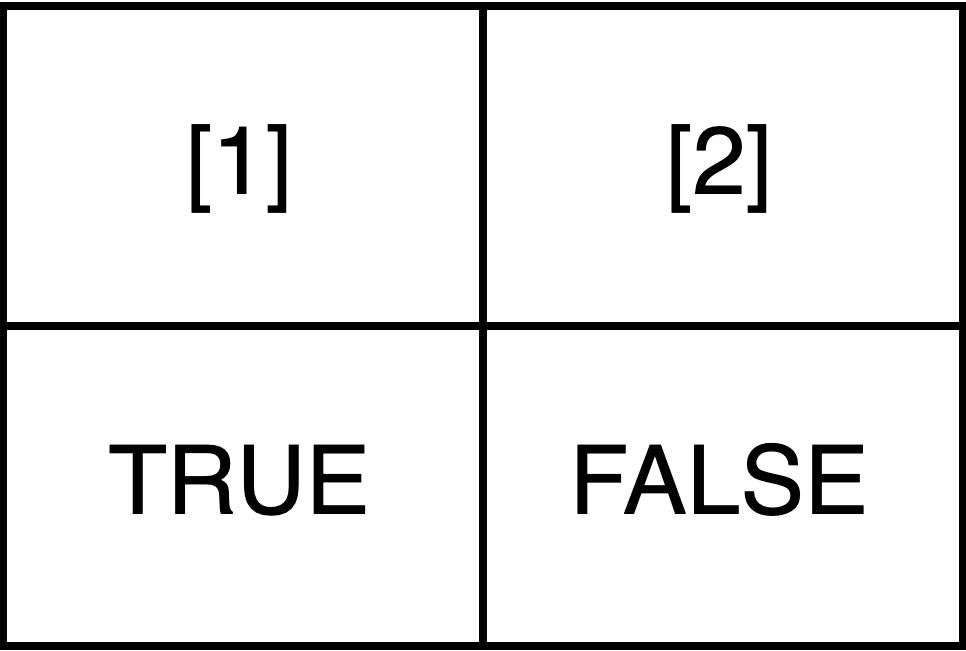
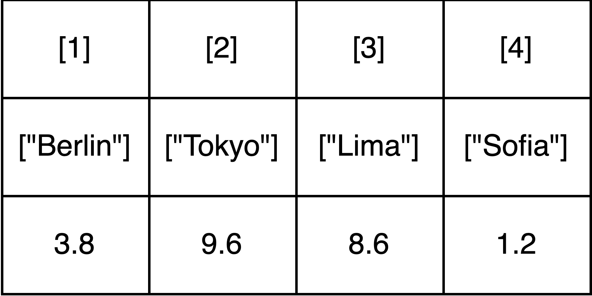
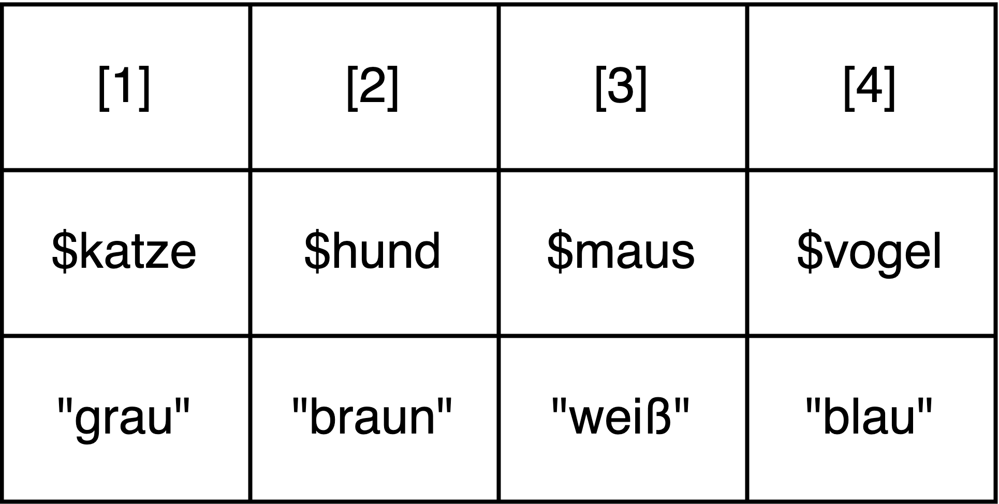
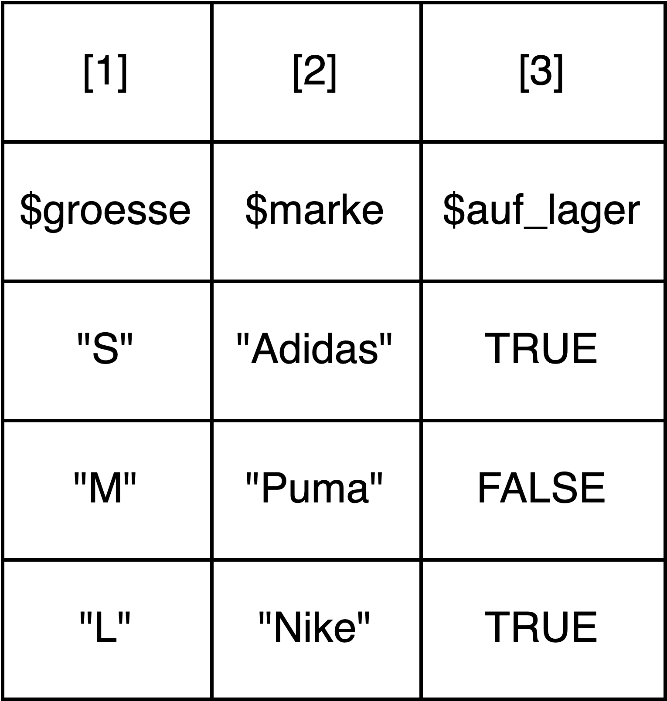

```{r setup, include=FALSE}
library(learnr)
library(tutorial.helpers)
library(learnr.tutorials) # for custom_question_text function

knitr::opts_chunk$set(echo = FALSE, tidy = FALSE)
```


## Aufgabe 1: Wiederholung


Lest euch nochmal die Inhalte zur Sitzung heute unter dem neuen Kapitel "R Basics II" auf unserer [Kurs-Website](https://lipogg.github.io/textanalyse-mit-r/) durch. Formuliert ein bis drei Fragen zu einem Inhalt, der euch noch nicht ganz klar ist.

```{r manual_frage1}
question_text(
  "Frage 1:",
  answer(".*", correct=TRUE),
  correct = NULL,
  incorrect = NULL,
  placeholder = "z.B. Was ist ein Datentyp?",
  allow_retry = FALSE,
  try_again = FALSE
)
```
```{r manual_frage2}
question_text(
  "Frage 2:",
  answer(".*", correct=TRUE),
  correct = NULL,
  incorrect = NULL,
  placeholder = "z.B. Was ist ein Datentyp?",
  allow_retry = FALSE,
  try_again = FALSE
)
```
```{r manual_frage3}
question_text(
  "Frage 3:",
  answer(".*", correct=TRUE),
  correct = NULL,
  incorrect = NULL,
  placeholder = "z.B. Was ist ein Datentyp?",
  allow_retry = FALSE,
  try_again = FALSE
)
```


## Aufgabe 2: Begriffsklärung

#### Erläutert kurz in euren eigenen Worten die folgenden Begriffe:

```{r q2_kommentar}
question_text(
  "Datenstruktur",
  answer(".*", correct=TRUE),
  correct = NULL,
  incorrect = NULL,
  placeholder = "Antwort eingeben...",
  allow_retry = FALSE,
  try_again = FALSE, 
  message = "Eine Datenstruktur ist eine strukturierte Sammlung von Werten (oder auch anderen Objekten in R). Verschiedene Datenstrukturen unterscheiden sich darin, wie die Daten organisiert sind und wie sie im Speicher repräsentiert werden."
)
```
```{r q2_character}
question_text(
  "Element",
  answer(".*", correct=TRUE),
  correct = NULL,
  incorrect = NULL,
  placeholder = "Antwort eingeben...",
  allow_retry = FALSE,
  try_again = FALSE,
  message = "Ein Element ist ein Wert oder ein anderes Objekt innerhalb einer Datenstruktur. Datenstrukturen können selbst Datenstrukturen als Elemente enthalten, z.B. kann eine Liste einen Vektor als Element haben."
)
```
```{r q2_datentyp}
question_text(
  "Index",
  answer(".*", correct=TRUE),
  correct = NULL,
  incorrect = NULL,
  placeholder = "Antwort eingeben...",
  allow_retry = FALSE,
  try_again = FALSE, 
  message = "Der Index ist eine Zahl, die der Position entspricht, die ein Element innerhalb einer Datenstruktur einnimmt. Mithilfe des Indexes kann auf den Wert an dieser Position zugegriffen werden."
)
```
```{r q2_variable}
question_text(
  "Zugreifen",
  answer(".*", correct=TRUE),
  correct = NULL,
  incorrect = NULL,
  placeholder = "Antwort eingeben...",
  allow_retry = FALSE,
  try_again = FALSE, 
  message = "Der Begriff Zugreifen wird im Zusammenhang von Datenstrukturen verwendet und beschreibt eine Operation, bei der ein oder mehrere Elemente aus der Datenstruktur ausgewählt und herausgegriffen werden, zum Beispiel, weil diese betrachtet oder verändert werden sollen."
)
```

## Aufgabe 3: Verständnis

#### 1) Welche Datenstrukturen werden durch die folgenden Bilder repräsentiert?

```{r fig1, echo = FALSE, out.width = "100%"}

```
```{r q3_1_1}
custom_question_text(
  text = " ", 
  variants = c("Vektor", "Vector", "boolescher Vektor", "boolean vector"),
  incorrect_msg = "Leider nicht richtig. Richtig wäre: Vektor"
  )
```

```{r fig2, echo = FALSE, out.width = "100%"}

```
```{r q3_1_2}
custom_question_text(
  text = " ", 
  variants = c("Vektor", "Vector", "named vector", "benannter Vektor"),
  incorrect_msg = "Leider nicht richtig. Richtig wäre: benannter Vektor (oder auch named vector)"
  )
```

```{r fig3, echo = FALSE, out.width = "100%"}

```
```{r q3_1_3}
custom_question_text(
  text = " ", 
  variants = c("Liste", "list"), 
  incorrect_msg = "Leider nicht richtig. Richtig wäre: Liste"
  )
```
```{r fig4, echo = FALSE, out.width = "100%"}

```
```{r q3_1_4}
custom_question_text(
  text = " ", 
  variants = c("Liste", "list"), 
  incorrect_msg = "Leider nicht richtig. Richtig wäre: Liste"
  )
```

#### 2.) Welchen Index haben die folgenden Elemente? 

*Gebt als Antwort jeweils nur die gesuchte Zahl an.*

```{r q3_2_1}
custom_question_text(
  text = "TRUE in der ersten Datenstruktur aus Teilaufgabe 1)", 
  variants = c("1", "Eins"), 
  incorrect_msg = "Leider nicht richtig. Richtig wäre: 1"
  )
```


```{r q3_2_2}
custom_question_text(
  text = "`8.6` in der zweiten Datenstruktur aus Teilaufgabe 1)", 
  variants = c("3", "Drei"), 
  incorrect_msg = "Leider nicht richtig. Richtig wäre: 3"
  )
```

```{r q3_2_3}
custom_question_text(
  text = '`"blau"` in der dritten Datenstruktur aus Teilaufgabe 1)', 
  variants = c("4", "Vier"), 
  incorrect_msg = "Leider nicht richtig. Richtig wäre: 4"
  )
```

#### 3.) Angenommen, die zweite Datenstruktur aus Teilaufgabe 1) heißt `hauptstaedte`. 


```{r quiz}
quiz(
  caption = "",
  question("Was wird auf dem Bildschirm ausgegeben, wenn der Code `hauptstaedte + 2` ausgeführt wird?",
    answer("eine Fehlermeldung"),
    answer("eine einzelne Zahl"),
    answer("ein Objekt mit derselben Datenstruktur wie das Objekt hauptstaedte", correct = TRUE),
    incorrect = "Leider nicht richtig. Richtig wäre: ein Objekt mit derselben Datenstruktur wie das Objekt `hauptstaedte`", 
    correct = "Super, das ist richtig!",
    allow_retry = FALSE
  )
)
```

#### 4.) Fügt über jeder Zeile im folgenden Code einen Kommentar hinzu, der in euren eigenen Worten beschreibt, was in der jeweiligen Zeile passiert. Wenn ihr alle Kommentare hinzugefügt habt, führt den Code durch Klick auf "Code ausführen" einmal aus. Erst dann sind eure Kommentare gespeichert. Durch Klick auf "Lösung" könnt ihr euch nach der Bearbeitung eine Beispiellösung anschauen. 

*Hinweis: Kommentare werden üblicherweise im Infinitiv formuliert. Ein möglicher Kommentar für die Codezeile `print("Hallo")` wäre z.B. `# Zeichenkette "Hallo" ausgeben`.*

```{r musik, exercise=TRUE, exercise.eval=FALSE, tidy = FALSE}

genres <- c("Jazz", "Klassik", "Rap", "Punk", "Techno", "Rock")

genres[3]
            
musiksammlung <- list(Genres=genres,
                      Musiker_innen=c("Miles Davis", 
                                      "Mozart", 
                                      "Missy Elliott", 
                                      "Bikini Kill", 
                                      "Juan Atkins", 
                                      "Cem Karaca"))

musiksammlung[[1]][3]

```


```{r musik-solution}
# Dem Namen genres den Vektor c(..) zuweisen
# Oder: Variable genres erstellen
genres <- c("Jazz", "Klassik", "Rap", "Punk", "Techno", "Rock")
# Auf Element mit Index 3 im Vektor genres zugreifen
# Oder: Auf drittes Element im Vektor genres zugreifen
genres[3]
# Dem Namen musiksammlung die Liste list(..) zuweisen
# Oder: Variable musiksammlung erstellen
musiksammlung <- list(Genres=genres, 
                      Musiker_innen=c("Miles Davis",
                                      "Mozart",
                                      "Missy Elliott", 
                                      "Bikini Kill",
                                      "Juan Atkins",
                                      "Cem Karaca"))
# Auf das erste Element der Liste musiksammlung, den Vektor genres, zugreifen und dann auf das dritte Element des Vektors genres zugreifen
musiksammlung[[1]][3]
```


## Aufgabe 4: Praxis 

*Hinweis: Den Code zu diesen Aufgaben findet ihr in den Abschnitten 2.2 und 2.3 auf der Kurswebsite.*

1.) Öffnet RStudio. Erstellt ein neues R Skript und speichert es mit einem geeigneten Dateinamen ab. Verfasst einen Kommentar mit dem Namen der Lehrveranstaltung, der Nummer des Übungsblatts und eurem Namen. 

2.) Denkt euch einen passenden Namen für eine Variable aus, die als Platzhalter für einen Vektor dienen soll, der die Titel von euren drei Lieblingsfilmen enthält. Erstellt den Vektor mithilfe der Funktion `c()`.  

3.) Überprüft, ob das erste Element des Vektors dem Wert "Star Wars" entspricht.  

*Hinweis: Dabei müssen zwei verschiedene Operationen durchgeführt werden: Zum einen muss auf das Element zugegriffen werden (R Basics II Abschnitt 2.2.4 "Zugriffsoperationen auf Vektoren"). Zum anderen muss das Element  mithilfe eines geeigneten Operators mit dem Wert "Star Wars" verglichen werden (R Basics I).* 

4.) Fügt am Ende des Vektors noch einen vierten Film hinzu und weist den Vektor einer neuen Variable zu. Nennt die Variable `alle_lieblingsfilme`.

5.) Greift auf das erste und dritte Element des neuen Vektors `alle_lieblingsfilme` zu und lasst euch die Werte auf dem Bildschirm ausgeben. 

6.) Greift auf die ersten drei Elemente des Vektors `alle_lieblingsfilme` zu und weist die Werte einer neuen Variable mit dem Namen `top_3` zu. 

### Freiwillige Zusatzaufgaben: 

7.) Erstellt zuletzt eine Liste. Die Liste soll zwei Elemente haben: "Lieblingsfilme" und "Jahr". Das Element mit dem Namen "Lieblingsfilme" soll der Vektor `alle_lieblingsfilme` sein. Das Element "Jahr" soll ein Vektor sein, der für jeden Film im Vektor `alle_lieblingsfilme` das Erscheinungsjahr enthält. 

8.) Wiederholt die Teilaufgaben 3), 5) und 6) mit der Liste aus Teilaufgabe 7). Wie müsst ihr die Zugriffsoperationen anpassen, damit ihr auf die Filmtitel in der Liste zugreifen könnt? 

9.) In Teilaufgabe 2) habt ihr überprüft, ob das erste Element des Vektors dem Wert "Star Wars" entspricht. Mit welchem Operator könnte man überprüfen, ob der Wert "Star Wars" irgendwo in dem Vektor enthalten ist?


```{r download-answers, child = system.file("child_documents/download_answers.Rmd", package = "tutorial.helpers")}
```
