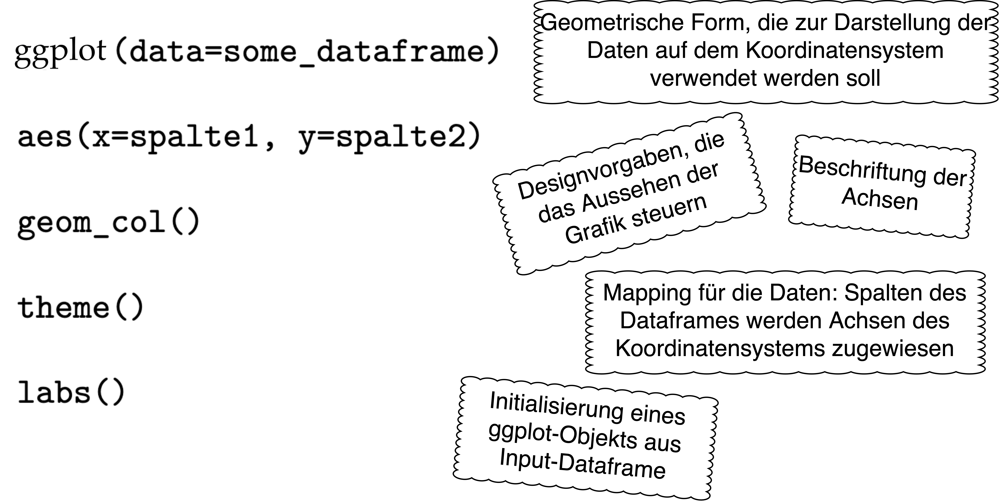

```{r setup, include=FALSE}
knitr::opts_chunk$set(echo = TRUE)
```


**Aufgabe 1: Wiederholung**

Lest euch nochmal das Kapitel "Textanalyse III" auf unserer Kurs-Website durch. Formuliert eine Frage zu einem Inhalt, der euch noch nicht ganz klar ist. 

**Aufgabe 2: Verständnis**

1.) Beantwortet die folgenden Fragen in einem Satz in euren eigenen Worten. 

* Was besagt das Zipf'sche Gesetz und welche Rolle spielt es beim Preprocessing?
* Welchen Einfluss hat die Lemmatisierung auf die Worthäufigkeiten?
* Was ist der Unterschied zwischen absoluten Häufigkeiten, relativen Häufigkeiten und TF-IDF?

2.) Ordnet die folgenden Bestandteile einer ggplot2-Grafik ihrer jeweiligen Bedeutung zu: 



3.) (fakulativ) Lest den folgenden Text zur Distributional Hypothesis und fasst in zwei Sätzen zusammen, was die Distributional Hypothesis besagt. Erinnert euch an den Beitrag von Evelyn Gius und Janina Jacke aus der ersten Woche. Inwieweit lässt sich die Kritik von Gius und Jacke auf die in dem Kapitel von Lenci und Sahlgren vorgestellten theoretischen Annahmen anwenden? Was denkt ihr: entsprechen die Annahmen der Distributional Hypothesis eurer Vorstellung von Sprache und Bedeutung?  

* Alessandro Lenci und Magnus Sahlgren (2023). *Distributional Semantics, Ch. 1: From Usage to Meaning. The Foundations of Distributional Semantics*, pp. 3-25, https://doi.org/10.1017/9780511783692.002.

4.) (fakultativ) Lest den optionalen Abschnitt zum mathematischen Hintergrund von TF-IDF. Berechnet danach händisch (also ohne die Hilfe der Funktion `dfm_tfidf()`) wie im Beispiel auf der Kurswebsite den TF-IDF Wert für ein Token, das insgesamt 50 mal vorkommt. Das Token kommt dabei in 35 verschiedenen Texten vor und das Korpus hat 200 Texte. 


**Aufgabe 3: Praxis**

Zur Bearbeitung dieser Aufgaben benötigt ihr die RDS-Datei, die ihr bei der Bearbeitung von Übungsblatt 8 erstellt habt. 

1.) Öffnet RStudio. Erstellt ein neues R Skript und speichert es mit einem geeigneten Dateinamen ab. Verfasst einen Kommentar mit dem Namen der Lehrveranstaltung, der Nr. des Übungsblatts und euren Namen.

2.) Setzt euer Arbeitsverzeichnis auf den Ordner, in dem sich die RDS-Datei, die ihr bei der Bearbeitung von Übungsblatt 8 erstellt habt, befindet. Die Datei sollte den UDPipe-Dataframe enthalten. 

3.) Lest die RDS-Datei ein. 

>Hinweis: Den Code zum Einlesen von RDS-Dateien findet ihr auf der Kurswebsite im [Abschnitt 5.10](https://lipogg.github.io/textanalyse-mit-r/textanalyse-i-korpus-tokens-daten-und-dateien.html#daten-schreiben).

4.) Entfernt alle Zeilen mit NA-Werten aus dem Dataframe. Falls es in dem Dataframe Tokens gibt, für die verschiedene Lemmata angegeben sind, entscheidet euch für eine Variante und löscht die anderen Varianten. 

>Hinweis: Den Code dazu findet ihr im [Abschnitt 7.7.2](https://lipogg.github.io/textanalyse-mit-r/textanalyse-ii-preprocessing.html#methode-2-lemmatisierung-mit-udpipe).
 
5.) Erstellt aus den Spalten lemma und doc_id ein Quanteda-Tokens-Objekt. 

>Hinweis: Den Code dazu findet ihr im [Abschnitt 7.7.2](https://lipogg.github.io/textanalyse-mit-r/textanalyse-ii-preprocessing.html#methode-2-lemmatisierung-mit-udpipe).

6.) Führt weitere Preprocessing-Schritte aus: Entfernt die Stoppwörter und wandelt alle Buchstaben in Kleinbuchstaben um. 

>Hinweis: Den Code dazu findet ihr im [Kapitel 7](https://lipogg.github.io/textanalyse-mit-r/textanalyse-ii-preprocessing.html). 

7.) Erstellt eine Wortwolke. 

>Hinweis: Dazu muss erst aus dem Tokens-Objekt ein DFM-Objekt erstellt werden sowie das Paket quanteda.textplots installiert und geladen werden. Den Code dazu findet ihr im [Abschnitt 8.3.1](https://lipogg.github.io/textanalyse-mit-r/textanalyse-iii-wortfrequenzanalysen.html#absolute-h%C3%A4ufigkeiten-und-das-zipfsche-gesetz).

8.) Verwendet die Funktion `textstat_frequency()`, um euch die 20 häufigsten Tokens etwas genauer anzusehen. Dabei interessiert euch die Häufigkeit der Tokens über alle Texte hinweg. Welches Token kommt insgesamt am häufigsten vor? Welches Token kommt in den meisten Texten vor?

>Hinweis: Den Code dazu findet ihr im [Kapitel 8](https://lipogg.github.io/textanalyse-mit-r/textanalyse-iii-wortfrequenzanalysen.html). Beachtet, dass wir die Funktion `textstat_frequency()` einmal mit dem zusätzlichen Argument groups=Titel aufgerufen haben. Braucht ihr dieses Argument, um die Häufigkeit über alle Texte hinweg zu bekommen? Entscheidet selbst.

9.) Speichert zuletzt das Tokens-Objekt mithilfe der Funktion saveRDS() in einer RDS-Datei.

10.) (fakultativ) Die Funktion `textstat_frequency()` erzeugt einen Dataframe mit den Spalten feature, frequency, rank, docfreq und group. Erstellt mithilfe der ggplot2-Funktion `ggplot()` ein Säulendiagramm. Auf der x-Achse sollen die 20 häufigsten Tokens abgebildet werden (Spalte feature). Auf der y-Achse soll die Anzahl der Texte, in denen das Token vorkommt, abgebildet werden (Spalte docfreq). 

>Hinweis: Den Code dazu findet ihr nicht auf der Kurswebsite, aber ihr könnt die ggplot-Dokumentationsseiten zu Rate ziehen, um die richtige Funktion zum Erzeugen der geom-Ebene auszuwählen. Falls ihr nicht darauf kommt: [hier](https://ggplot2.tidyverse.org/reference/geom_bar.html) findet ihr die richtige Funktion. Aber Achtung: Säule heißt auf Englisch column.

11.) (fakultativ) Berechnet für zwei Texte aus dem Korpus TF-IDF Werte. Reproduziert dazu den Code im [Abschnitt 8.3.3 auf der Kurswebsite](https://lipogg.github.io/textanalyse-mit-r/textanalyse-iii-wortfrequenzanalysen.html#relative-h%C3%A4ufigkeiten-und-tf-idf). 

